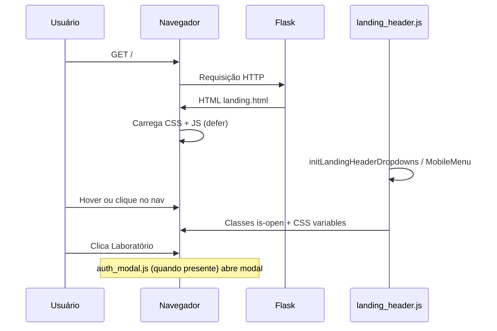

# ProENEM Lab — Documentação da aplicação

Plataforma web em **Flask** voltada ao ENEM. Nesta versão (`v0`), a aplicação entrega a **landing page** com cabeçalho fixo, mega menus de navegação, alternância de tema (claro/escuro/sistema) e integração prevista com **modal de autenticação** (login no botão “Laboratório”).

---

## Índice

1. [Visão geral](#visão-geral)
2. [Estrutura do repositório](#estrutura-do-repositório)
3. [Como executar](#como-executar)
4. [Arquivos referenciados mas ausentes no workspace](#arquivos-referenciados-mas-ausentes-no-workspace)
5. [Backend — `Projeto/app.py`](#backend--projetoapppy)
6. [Template principal — `Projeto/templates/landing.html`](#template-principal--projetotemplateslandinghtml)
7. [Componente Jinja — `landing_nav_mega_menu.html`](#componente-jinja--landing_nav_mega_menuhtml)
8. [JavaScript — `landing_header.js`](#javascript--landing_headerjs)
9. [CSS global — `presets.css`](#css-global--presetscss)
10. [CSS da landing — `landing.css`](#css-da-landing--landingcss)
11. [CSS de autenticação — `auth.css`](#css-de-autenticação--authcss)
12. [Fluxo de dados e interação](#fluxo-de-dados-e-interação)

---

## Visão geral

| Camada | Tecnologia | Responsabilidade |
|--------|------------|------------------|
| Servidor | Flask | Rota `/`, renderização Jinja2 |
| Marcação | HTML + Jinja2 | SEO, header, âncoras, includes |
| Estilo | CSS (3 folhas) | Design tokens, header, modal auth |
| Comportamento | JavaScript | Mega menu desktop/mobile, métricas CSS |

O ponto de entrada HTTP é `GET /`, que devolve `landing.html` sem API nem banco de dados nesta versão.

---

## Estrutura do repositório

```
v0/
├── README.md                          ← este arquivo
├── .gitignore
└── Projeto/
    ├── app.py                         ← aplicação Flask
    ├── templates/
    │   ├── landing.html
    │   └── components/
    │       └── landing_nav_mega_menu.html
    └── static/
        ├── css/
        │   ├── presets.css            ← tokens, reset, tema
        │   ├── landing.css            ← header e layout da landing
        │   └── auth.css               ← formulário/modal de login
        ├── js/
        │   └── landing_header.js      ← navegação do header
        └── assets/                    ← fontes, imagens (referenciadas nos templates)
            ├── fonts/
            └── images/
```

---

## Como executar

```bash
cd Projeto
python -m venv .venv
# Windows
.venv\Scripts\activate
# Linux/macOS
# source .venv/bin/activate

pip install -r requirements.txt
python app.py
```

Abra `http://127.0.0.1:5000/`.

## Deploy (Vercel + GitHub)

| Recurso | URL |
|---------|-----|
| Repositório | https://github.com/ProENEMLab/Projeto_V2 |
| Código da app | pasta `Projeto/` neste repositório |

Na Vercel, ao importar `Projeto_V2`, defina **Root Directory** = `Projeto`. Detalhes em [`Projeto/README.md`](Projeto/README.md).

---

## Arquivos referenciados mas ausentes no workspace

`landing.html` referencia recursos que **devem existir** em produção, mas não estão na pasta atual do repositório:

| Arquivo | Uso |
|---------|-----|
| `templates/components/auth_modal.html` | Modal de login (``) |
| `static/js/global.js` | Comportamento global (tema, etc.) |
| `static/js/auth.js` | Lógica do formulário de auth |
| `static/js/auth_modal.js` | Abrir/fechar modal (`data-open-auth-modal`) |
| `static/assets/**` | Imagens, fontes, ícones citados em meta tags e CSS |

Sem esses arquivos, a página pode carregar parcialmente; o botão “Laboratório” e o tema podem não funcionar até implementá-los.

---

## Backend — `Projeto/app.py`

| Linha | Código | Explicação |
|-------|--------|------------|
| 1 | `from flask import Flask, render_template, url_for` | Importa a classe da app, renderização de templates e geração de URLs estáticas. `url_for` é usado nos templates, não neste arquivo. |
| 2 | *(vazia)* | Separação visual entre imports e código. |
| 3 | `app = Flask(__name__)` | Cria a instância Flask. `__name__` define o pacote raiz para achar `templates/` e `static/` em `Projeto/`. |
| 4 | *(vazia)* | — |
| 5 | `@app.route('/')` | Registra a view para a URL raiz. |
| 6 | `def landing():` | Nome da view; usado em `url_for('landing')` nos templates. |
| 7 | `return render_template('landing.html')` | Renderiza o HTML com Jinja2, sem variáveis de contexto explícitas. |
| 8 | *(vazia)* | — |
| 9 | `if __name__ == '__main__':` | Só executa o bloco abaixo quando o arquivo é rodado diretamente (`python app.py`), não quando importado. |
| 10 | `app.run(debug=True)` | Sobe o servidor de desenvolvimento com recarregamento automático e tracebacks no navegador. |

---

## Template principal — `Projeto/templates/landing.html`

### Cabeçalho do documento (linhas 1–30)

| Linhas | Conteúdo | Explicação |
|--------|----------|------------|
| 1 | `<!DOCTYPE html>` | Modo padrões HTML5. |
| 2 | `lang="pt-BR"` | Idioma para leitores de tela e SEO. |
| 4 | `charset=UTF-8` | Codificação de caracteres. |
| 5 | `viewport` + `viewport-fit=cover` | Layout responsivo; `cover` respeita entalhes (notch) em iOS. |
| 6 | `meta description` | Resumo para buscadores. |
| 7 | `link rel="canonical"` | URL canônica via `url_for('landing', _external=True)`. |
| 9–16 | Open Graph | Metadados para compartilhamento (Facebook, WhatsApp, etc.). |
| 18–21 | Twitter Card | Preview no Twitter/X. |
| 23 | `favicon` | Ícone da aba (`lb_book_favicon.png`). |
| 25 | `preload` da fonte Raleway | Carrega WOFF2 cedo para reduzir FOIT. |
| 26–28 | Folhas de estilo | Ordem: `presets` → `landing` → `auth` (tokens antes dos componentes). |
| 29 | `<title>` | Título da aba. |

### Corpo — header (linhas 31–175)

| Linhas | Conteúdo | Explicação |
|--------|----------|------------|
| 31 | `id="landing_body"` | Alvo de estilos específicos da landing em `landing.css`. |
| 32 | `` | Importa a macro Jinja do mega menu. |
| 33–35 | `header` + watermark | Banner acessível; marca d’água decorativa (`aria-hidden`). |
| 37–40 | Logo | Link para `url_for('landing')` com imagem 40×40. |
| 42–55 | Botão hambúrguer | `data-nav-menu-toggle` — controlado por `landing_header.js` no mobile. Três barras são puramente visuais. |
| 57–62 | Ações desktop | “Ajuda” (`#ajuda`) e “Laboratório” (`data-open-auth-modal`, modo login). |
| 65–174 | `<nav id="landing_header_nav">` | Links âncora e quatro dropdowns (Recursos, Gamificação, Roadmap, Buscar). |
| 66 | `is-active` em Início | Estado visual do link atual (placeholder até rolagem dinâmica). |
| 68–90 | Dropdown Recursos | `data-nav-dropdown` + macro com 6 itens, rodapé e painel “destaque” com imagem. |
| 93–116 | Gamificação | Mesmo padrão; ícones `trophy`, `chart`, etc. |
| 118–141 | Roadmap | Itens de produto/versões. |
| 143–166 | Buscar | Busca unificada (âncoras placeholder). |
| 168–173 | Ações no nav mobile | Duplicam Ajuda/Laboratório dentro do menu colapsável. |

Cada chamada `landing_nav_mega_menu(...)` passa, nesta ordem: `menu_id`, `trigger_id`, lista de `items` (`href`, `label`, `desc`, `icon`), `footer_href`, `footer_label`, título do destaque, `featured_href`, texto do botão, caminho da imagem em `static/`.

### Restante do body (linhas 177–217)

| Linhas | Conteúdo | Explicação |
|--------|----------|------------|
| 177 | `data-nav-backdrop` | Overlay escurecido ao abrir menu mobile; `hidden` por padrão. |
| 179–192 | Seletor de tema | Três botões (sol, lua, dispositivo); IDs usados por `global.js` (quando existir). |
| 194–209 | `<main>` | Seções vazias com `id` correspondentes aos links do menu (âncoras de navegação). |
| 211 | `` | Injeta HTML do modal de autenticação. |
| 213–216 | Scripts `defer` | Executam após parse do HTML, na ordem: global → header → auth → auth_modal. |

---

## Componente Jinja — `landing_nav_mega_menu.html`

### Macro `nav_icon(name)` (linhas 1–45)

Renderiza um **SVG inline** 24×24 conforme o nome do ícone. Cada `` desenha paths stroke-based (grid, book, clipboard, calendar, play, file, trophy, star, chart, target, bolt, medal, map, layers, sparkle, code, flask, search, help, bookmark). Se o nome não existir, cai no `` com um círculo genérico. Todos usam `aria-hidden="true"` porque o texto do link já descreve o destino.

### Macro `landing_nav_mega_menu(...)` (linhas 47–81)

| Linhas | Elemento | Explicação |
|--------|----------|------------|
| 48 | `role="menu"` | Padrão ARIA de menu; `aria-labelledby` aponta ao botão trigger. |
| 51–63 | Lista `<ul>` | Loop ``: link com ícone, rótulo e descrição. |
| 64 | Rodapé | Link “Ver todos…” com seta no texto. |
| 66–78 | `<aside>` destaque | Coluna direita no desktop: imagem lazy-loaded ou vazio; título + CTA. |
| 67–72 | Imagem | Só renderiza se `featured_img` e não `featured_use_logo`. |
| 76 | Botão destaque | Link secundário de conversão no painel. |

Parâmetros da macro:

- `menu_id` / `trigger_id` — ligação ARIA entre botão e painel.
- `items` — dicionários com `href`, `label`, `desc`, `icon`.
- `footer_href`, `footer_label` — link inferior do painel esquerdo.
- `featured_title`, `featured_href`, `featured_btn` — coluna promocional.
- `featured_img` — caminho relativo a `static/` (ex.: `assets/images/nav_dropdown_recursos.png`).
- `featured_use_logo` — opcional; classe extra se o destaque for logo em vez de foto.

---

## JavaScript — `landing_header.js`

Breakpoint mobile: **`(max-width: 1023px)`** — abaixo disso, menu hambúrguer e acordeões; acima, hover/focus nos mega menus.

### Constantes e utilitários (linhas 1–36)

| Linhas | Função | Explicação |
|--------|--------|------------|
| 1 | `LANDING_HEADER_MOBILE_MQ` | Media query compartilhada. |
| 3–5 | `isLandingHeaderMobile()` | `matchMedia(...).matches`. |
| 7–13 | `closeAllNavDropdowns` | Remove `is-open` e `aria-expanded="false"` em todos `[data-nav-dropdown]`. |
| 15–23 | `getFocusableNavElements` | Lista elementos tabuláveis visíveis (links, botões, inputs) para foco preso no menu mobile. |
| 25–36 | `isPointerOverNavDropdown` / `isPointerOverAnyNavDropdown` | Evita fechar dropdown desktop enquanto o cursor está sobre o painel (inclui `menu_inner`). |

### `initLandingHeaderDropdowns()` (linhas 38–236)

| Linhas | Comportamento |
|--------|----------------|
| 39–41 | Obtém `#landing_header_nav` e todos `[data-nav-dropdown]`; sai se não houver dropdowns. |
| 43–45 | `closeDelayMs = 260` — atraso antes de fechar ao sair com o mouse. |
| 47–52 | `clearCloseTimer` — cancela timeout pendente. |
| 54–67 | `scheduleClose` — no desktop, agenda fechamento se o ponteiro não estiver em nenhum dropdown. |
| 69–87 | `openNavDropdown` — fecha os outros, adiciona `is-open`, `aria-expanded="true"`, chama `updateLandingHeaderMetrics()`. |
| 95–102 | `setDropdownOpen` — alterna classe/ARIA; atualiza métricas ao abrir no desktop. |
| 108–122 | `toggleDropdownMobile` — no mobile, accordion: um dropdown aberto por vez. |
| 124–129 | `click` no trigger (mobile) — `preventDefault` + `stopPropagation` + toggle. |
| 131–151 | `keydown` — Escape fecha; Enter/Espaço/ArrowDown abre no desktop e foca primeiro link. |
| 153–186 | Listeners mouse/focus (desktop) — hover abre; `pointerdown` em link limpa timer; clique em link com `href` real fecha menus. |
| 189–203 | `mouseover` no nav — hover em trigger abre; hover em link simples fecha todos. |
| 205–208 | Escape global fecha dropdowns desktop. |
| 210–223 | `pointerdown` fora fecha dropdowns. |
| 225–233 | `resize` / `visualViewport` — recalcula CSS vars de posicionamento. |
| 235 | `change` na media query — fecha dropdowns ao cruzar breakpoint. |

### `updateLandingHeaderMetrics()` (linhas 238–255)

Mede `.landing_header` com `getBoundingClientRect()` e grava no `:root`:

- `--landing-header-bar-bottom` — base da barra do header.
- `--landing-nav-left` / `--landing-nav-width` — alinhar menu mobile fixo ao header.
- `--landing-header-bottom` — topo do backdrop (considera nav expandido no mobile).

### `initLandingHeaderMobileMenu()` (linhas 257–383)

| Linhas | Comportamento |
|--------|----------------|
| 264 | Retorna cedo se faltar header, toggle, nav ou backdrop. |
| 270–302 | `setMenuOpen` — classes `is-nav-open`, `landing-header-nav-open` no body, backdrop `hidden`, foco inicial/restore, `ResizeObserver` no nav aberto. |
| 306–310 | Toggle alterna menu no mobile. |
| 312–314 | Clique no backdrop fecha. |
| 316–324 | Clique em link ou `data-open-auth-modal` fecha o menu. |
| 326–342 | Tab trap — Shift+Tab no primeiro foca o último e vice-versa. |
| 344–352 | Clique fora do header fecha. |
| 354–358 | Escape devolve foco ao botão hambúrguer. |
| 361–364 | Ao voltar para desktop (`change` MQ), fecha menu. |
| 366–380 | Resize/viewport — fecha menu se não for mobile; atualiza métricas com nav aberto. |

### Inicialização (linhas 385–388)

`DOMContentLoaded` chama as duas funções `init*`.

---

## CSS global — `presets.css`

Documentação por blocos (cada bloco cobre as linhas indicadas).

### Linhas 1–8 — `@font-face`

Registra **Raleway** variável (pesos 100–900) em WOFF2 e TTF fallback; `font-display: swap` evita texto invisível prolongado.

### Linhas 10–14 — reset `*`

`box-sizing: border-box` e zera margin/padding em todos os elementos.

### Linhas 16–74 — `:root` (design tokens)

| Variável | Função |
|----------|--------|
| `--yellow-color`, `--blue-color`, `--highlight-color` | Paleta de marca e CTAs |
| `--border-radius`, `--main-button-height`, … | Geometria de botões |
| `--background-color`, `--text-color`, `--details-color`, … | Tema claro base |
| `--dark-*` | Valores do tema escuro (referenciados depois) |
| `--z-base` … `--z-modal` | Empilhamento (header, overlay, modal) |
| `--auth-intro-*` | Durações/delays de animação do fluxo auth |
| `--bp-xs` … `--bp-xl` | Breakpoints de referência |
| `--page-pad-inline`, `--touch-target-min` | Espaçamento e alvo mínimo de toque (44px) |

### Linhas 76–86 — `html`

Altura 100%, evita zoom de texto indesejado, `overflow-x: clip`. Classe `auth_modal_open` bloqueia scroll da página quando o modal está aberto.

### Linhas 88–97 — modal aberto

Esconde o seletor de tema lateral enquanto o modal de auth está ativo.

### Linhas 99–131 — temas

- `prefers-color-scheme: dark` sem `data-theme` — aplica tokens escuros.
- `html[data-theme="dark"]` — tema escuro explícito (sobrescreve preferência do SO quando o JS define atributo).

### Linhas 133–140 — `@keyframes fade_in_toggle_theme_button_hover`

Anima opacidade de 0.7 → 1 no hover dos botões de tema.

### Linhas 142–152 — `.visually_hidden`

Padrão “screen reader only” (texto acessível sem ocupar layout).

### Linhas 154–161 — `body`

Layout fluido, `min-height: 100dvh`, cores via variáveis CSS.

### Linhas 163–166 — `.highlighted_text`

Destaque em azul (`--highlight-color`).

### Linhas 168–273 — `#style_section_toggle_theme_button`

Coluna fixa à esquerda (desktop); em `max-width: 1024px` vira linha horizontal. Três botões com cores `--toggle-theme-a/b/c`; estado ativo via `[aria-current="true"]`. Intro animada só antes de `:root.theme_intro_done`.

### Linhas 282–289 — `prefers-reduced-motion`

Desativa animações/transições longas para acessibilidade.

---

## CSS da landing — `landing.css`

Arquivo com **1626 linhas**. Abaixo, cada seção com intervalo de linhas e propósito das regras principais.

### `#landing_body` e tema no header (1–149)

- **1–17:** Variáveis locais de cor do header e painéis do mega menu; fonte Raleway; fundo da página.
- **19–35:** Reposiciona o seletor de tema como `fixed` à esquerda na landing (sobrescreve `presets.css`).
- **37–53:** `.landing_header` — barra flutuante centralizada (`left: 50%`, `transform`), 95% largura, 80px altura, borda sutil.
- **55–57:** Watermark em `` oculto (decorativo via `::before`).
- **59–75:** `::before` — logo ProENEM Lab semitransparente no fundo do header.
- **77–97:** Overrides quando `data-theme="light"` ou `"dark"` (cores do nav e painel branco no escuro).
- **109–149:** Espelha lógica de tema para `prefers-color-scheme` sem atributo `data-theme`.

### Layout do header e navegação desktop (151–377)

- **151–162:** Grid 3 colunas no container (logo | centro implícito | ações).
- **164–194:** Estilo do logo e texto opcional.
- **196–315:** Links e triggers do nav — tamanhos, hover, estado `.is-active`, caret rotacionado, focus ring.
- **317–377:** `.landing_header_nav_menu` — painel mega menu absoluto, animação opacity/transform, variáveis de escala (`--nav-menu-scale`, largura máx. 840px), estado fechado (`visibility: hidden`, `pointer-events: none`).

### Interior do mega menu (379–825)

- **379–393:** Grid duas colunas (lista + destaque), borda, sombra interna, `isolation`.
- **396–405:** `::before` com `backdrop-filter` isolado para não quebrar `overflow` com zoom na imagem.
- **407–528:** Painel de links, lista, ícones SVG animados, hover, rodapé, coluna featured com imagem ampliada (`--nav-menu-featured-img-scale`).
- **777–825:** Keyframes de entrada dos itens; `prefers-reduced-motion` simplifica transições.

### Menu hambúrguer e ações (826–1002)

- **832–917:** Botão toggle (oculto no desktop), animação das três barras em “X” quando `.is-nav-open`.
- **919–987:** Botões Ajuda (ghost) e Laboratório (primary); cores invertidas no tema claro explícito.
- **995–1002:** `.landing_main` — `padding-top` compensa header fixo.

### Desktop ≥1024px (1004–1055)

Header vira grid: nav centralizado com `pointer-events: none` no container e `auto` nos filhos (clique só nos links).

### Mobile ≤1023px (1057–1501)

- Variáveis de padding e altura máxima do menu scrollável.
- Header compacto, toggle visível, ações dentro do nav.
- **1148–1171:** Backdrop fixo abaixo de `--landing-header-bottom`.
- **1173–1226:** Nav vira painel dropdown; quando aberto, `position: fixed` alinhado às vars JS.
- **1301–1448:** Mega menus viram acordeão (`max-height: 0` → `80rem`); coluna featured **oculta** no mobile.
- **1496–1499:** Ajuste de padding do `main`.

### Media queries adicionais (1503–1625)

| Linhas | Alvo |
|--------|------|
| 1503–1543 | Telefones ≤640px |
| 1545–1570 | Landscape baixo ≤1023px |
| 1572–1585 | Tablet 1024–1280px (mega menu menor) |
| 1587–1608 | ≤480px (esconde botão ghost no nav) |
| 1610–1625 | ≤360px (fontes e padding mínimos) |

---

## CSS de autenticação — `auth.css`

Arquivo com **~1836 linhas** — estilos do formulário de login/cadastro e do **modal** sobre a landing. Resumo por blocos:

### Animações (1–121)

| Keyframes | Efeito |
|-----------|--------|
| `fade_in_plus_background` | Flash de fundo ao validar |
| `fade_in_logo_auth` | Logo entra de cima |
| `fade_in_divider_auth` | Divisor cresce em altura |
| `fade_in_layers_auth` | Camadas artísticas deslizam |
| `fade_in_toggle_theme_button_auth` | Botões de tema na intro auth |
| `fade_in_out_validation_*` | Feedback erro/sucesso no botão submit |
| `fade_in_rest_auth` | Fade-in geral do formulário |

Classes `.auth_btn_anim_error` / `.auth_btn_anim_ok` ligam essas animações ao botão.

### Tokens `:root` auth (122–190)

Larguras fluidas (`clamp`), fonte auth, URLs das camadas ilustrativas (`layer_*`), variáveis do **modal 3:4** com escala tipográfica baseada em viewport (`--auth-modal-device-fit`, `--auth-modal-type-scale`, etc.).

### Layout do formulário (192–518)

- Padding responsivo em `#auth_form_container` / `#auth_form_content`.
- Troca de imagens de arte e fundo por `data-theme` e `prefers-color-scheme: dark`.
- `body.auth_page` — página dedicada de login em tela cheia.
- Grid do conteúdo: cabeçalho, campos, rodapé (Google, links, termos).

### Campos e controles (519–1006)

- Títulos, inputs, estados de erro (`.auth_form_content_input_title_error`).
- Campo senha com toggle mostrar/ocultar (ícones open/closed).
- Checkbox de termos customizado (`::before`, checkmark).
- Botões primário/secundário, divisor “ou”, botão Google com ícone.

### Painel visual `#auth_style_container` (1007+)

Coluna decorativa com camadas parallax (`--auth-art-1/2/3`) e fundo `--auth-style-background`.

### Modal `.auth_modal*` (1163–1450+)

| Seletor | Função |
|---------|--------|
| `.auth_modal_overlay` | Fundo escurecido clicável |
| `.auth_modal[hidden]` | Esconde quando atributo `hidden` |
| `.auth_modal` | Container fixo fullscreen, z-index modal |
| `.auth_modal_dialog` | Caixa 3:4 centralizada, grid form + arte em landscape |
| `auth_modal_dialog_pop` | Animação abrir/fechar (220ms) |
| Regras `.auth_modal_dialog #auth_*` | Tipografia e espaçamentos reduzidos dentro do modal |

Media queries ajustam o modal em telas estreitas, altura baixa e `container queries` onde aplicável.

---

## Fluxo de dados e interação



### Atributos `data-*` importantes

| Atributo | Onde | Efeito |
|----------|------|--------|
| `data-nav-menu-toggle` | Botão hambúrguer | Abre/fecha nav mobile |
| `data-nav-dropdown` | Wrapper do mega menu | Agrupa trigger + painel |
| `data-nav-backdrop` | Div após header | Overlay mobile |
| `data-open-auth-modal` | Botão Laboratório | Abre modal (JS externo) |
| `data-auth-open-mode="login"` | Idem | Modo inicial do modal |

### Variáveis CSS definidas em JavaScript

| Variável | Uso |
|----------|-----|
| `--landing-header-bar-bottom` | Posição vertical do menu mobile fixo |
| `--landing-nav-left` / `--landing-nav-width` | Largura/alinhamento do nav aberto |
| `--landing-header-bottom` | Topo do backdrop semitransparente |

---

## Próximos passos sugeridos (fora do escopo deste README)

- Adicionar `requirements.txt` e `README` em `Projeto/` se o deploy for só da subpasta.
- Versionar `auth_modal.html`, `global.js`, `auth.js`, `auth_modal.js` e assets.
- Preencher seções vazias em `<main>` com conteúdo real da landing.
- Substituir `debug=True` por configuração de produção (Gunicorn, variáveis de ambiente).

---

*Documentação gerada com base nos arquivos presentes em `Projeto/` neste repositório. Para alterações no código, atualize as tabelas de linhas correspondentes.*
